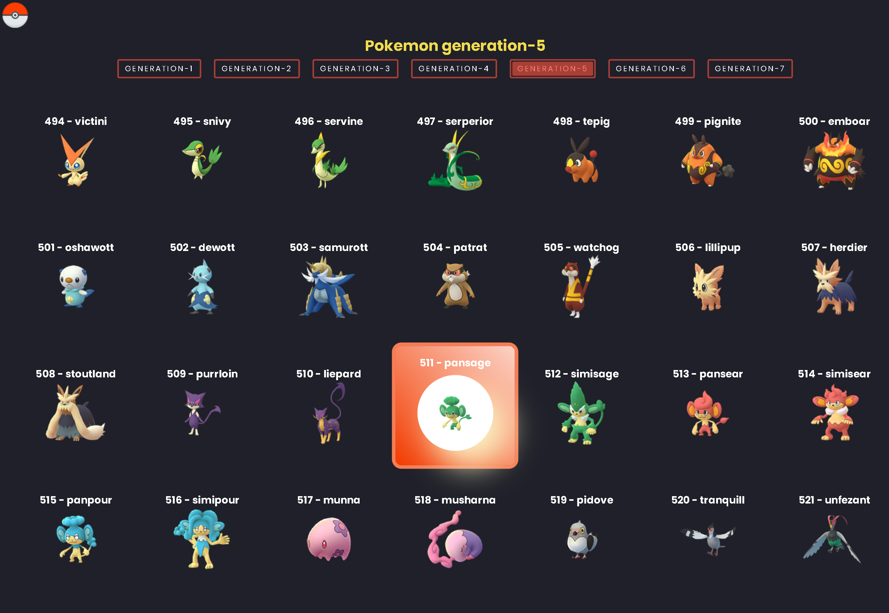
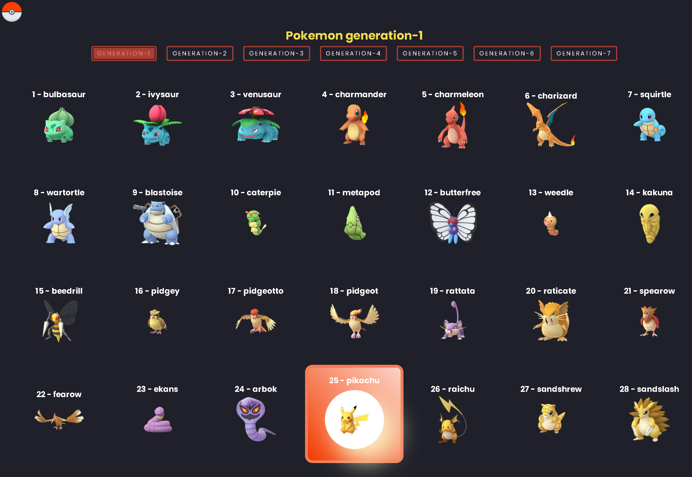

# Javascript - Fundamentos

## Tecnologías Utilizadas:

- Javascript
- Sass
- Fetch Api (Js) 
- Intersection Observer Api (Js)

---
## Descripción 📘 

Proyecto creado para asentar y recordar el uso de Fetch Api, consumir apis públicas o bien privadas/propias y servir la informaicón deseada.
Además se emplea el uso de Intersection Observer, con lo cual, ahorramos recursos mejorando la velocidad en tiempo de carga de las imágenes requeridas, las imágenes se van cargando de acuerdo al punto de intersección al observar. 

---
## Vista Principal 🎨 
---

